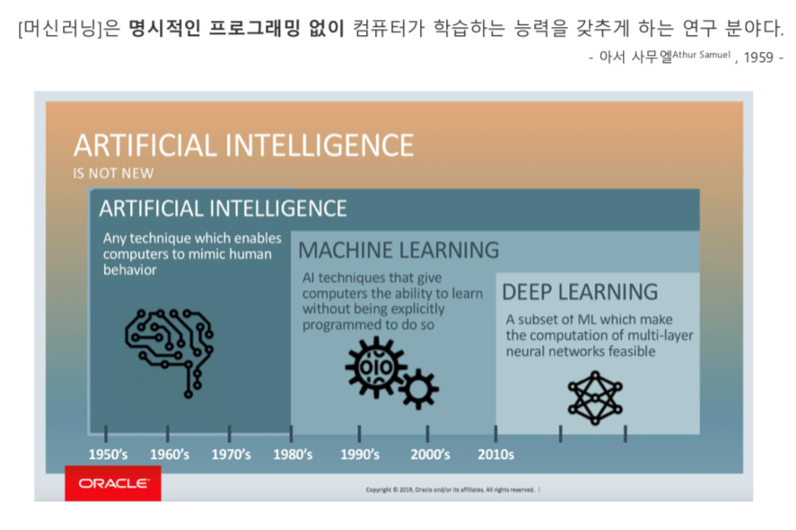
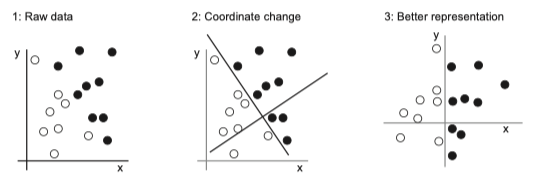
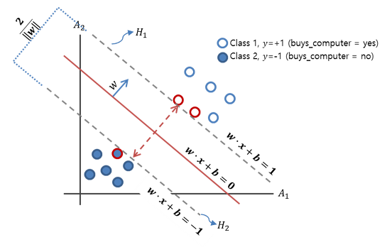
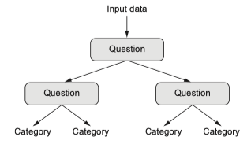
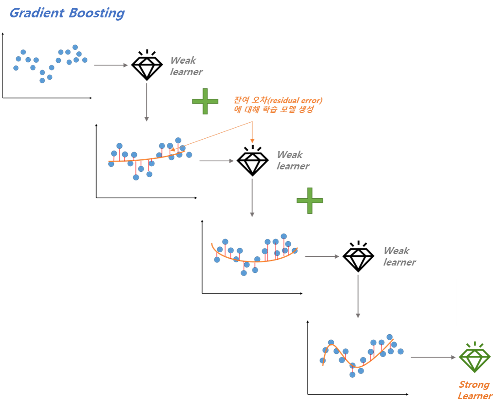
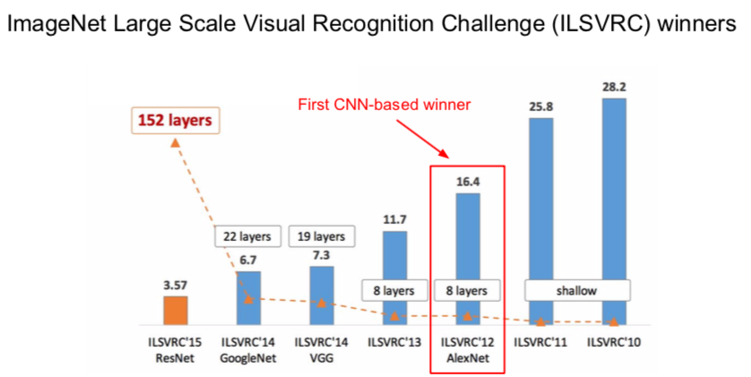

# Chap01 - 딥러닝이란 무엇인가?

## Goals

- 핵심 개념에 대한 High-Level의 정의
- 머신러닝의 발전과정
- 딥러닝이 인기를 끈 주요 요인과 미래의 가능성

## 1.1 인공지능과 머신러닝, 딥러닝

### 1.1.1 인공지능

- 일반적인 사람이 수행하는 지능적인 작업을 자동화하기 위한 연구 활동이다.
- 명시적인 규칙을 충분하게 많이 만들어 인공지능을 만드는 방법을 **심볼릭 AI**(symbolic AI)라고 하며 1950 ~ 1980년대까지 AI 분야의 지배적인 패러다임이었다. 1980년대에는 **전문가 시스템**(expert system)이 인기를 끌었다.
- 심볼릭 AI를 대체하기 위한 새로운 방법이 바로 **머신러닝**이다.

### 1.1.2 머신러닝

- *프로그래머가 직접만든 규칙(rule)대신 컴퓨터가 데이터를 보고 자동으로 규칙을 학습할 수 있을까?* → **머신러닝의 패러다임**

- 데이터에서 통계적 구조를 찾은 뒤, 이 작업을 자동화하기 위한 규칙을 만든다.
- 머신러닝은 명시적으로 프로그래밍되는 것이 아니라 **훈련**(training)된다.

### 1.1.3 데이터에서 표현을 학습하기

- 머신러닝은 데이터와 기대값(정답)이 주어졌을 때 데이터 처리 작업을 위한 실행 규칙을 찾는 것이다. → *Supervised Learning*
- 머신러닝을 하기 위해서는 다음의 세 가지가 필요하다.
  - **입력 데이터 포인트** : 규칙을 찾고자 하는 데이터
  - **기대 출력** : 레이블(label), 정답이라고도 하며, 데이터 포인트에 대응되는 레이블
  - **성능 측정 지표** : 알고리즘의 출력값($\hat{y}$)과 정답($y$)간의 차이를 측정하는 알고리즘 (MSE, CEE) → 차이를 줄여나가는 과정을 **학습**(learning)이라고 함
- 머신러닝/딥러닝 모델은 입력 데이터를 의미있는 출력, 즉 **의미있는 데이터로의 변환**, **유용한 표현**(representation)을 학습하는 것이다. 

- 머신러닝에서의 **학습**(learning)이란 더 나은 표현을 찾는 자동화된 과정이다.
- 머신러닝 알고리즘은 일반적으로 **가설 공간**(hypothesis space)을 사전에 정의하고, 이 공간에 대해 입력 데이터에서 유용한 변환을 찾는 것이다.
  - *가설공간(hypothesis space)는 어떤 문제를 해결하는데 필요한 가능성 있는 가설 후보군의 집합을 의미한다.*
- 따라서, 머신러닝은 입력(예: 이미지) 타겟(target, 예: '고양이' 레이블)을 학습하면서 입력을 타겟에 매핑(mapping)하는 것이다.

### 1.1.4 딥러닝에서 '딥'이란 무엇일까?

- 딥러닝은 머신러닝의 특정한 한 분야로서 연속된 **층**(layer)에서 데이터로부터 의미있는 표현을 학습하는 방법이다.

- 딥러닝의 **딥(deep)**은 연속된 층으로 표현을 학습한다는 개념이며, 딥러닝 모델에서 층의 개수가 모델의 **깊이**(depth)가 된다.

- 딥러닝은 단순히 데이터로부터 **표현**(represntation)을 학습하는 수학 모델일 뿐이다.

- 딥러닝에서는 층을 겹겹이 쌓아 올려 구성한 **신경망**(neural network)이라는 모델을 사용하여 표현 층을 학습 한다.

- 심층 신경망(DNN)은 정보가 연속된 필터(filter)를 통과하면서 순도 높게 정제되는 다단계 정보 추출 작업으로 생각할 수 있다.

### 1.1.5 딥러닝의 작동 원리 이해하기

- 심층 신경망은 **'입력-타겟' 매핑**을 층을 많이 연결하여 수행한다. 
- 층에서 입력 데이터가 처리되는 상세 내용은 일련의 숫자로 이루어진 층의 **가중치**(weight)에 저장되어 있다.
- 심층 신경망에서의 **학습**은 입력을 타겟에 매핑하기위해 신경망의 모든 층에 있는 가중치 값을 찾는 것이다.
- 이러한 가중치 값을 조정(찾기)하기 위해서는 신경망의 출력(예측)과 실제 타겟의 거리(차이)를 측정하는 **손실함수(loss function)**를 사용한다.
- 가중치 값을 조정하는 과정은 딥러닝의 알고리즘인 **역전파(backpropagation)**을 구현한 **옵티마이저(optimizer)**가 담당한다.

- 훈련 초기에는 네트워크의 가중치가 랜덤한 값으로 할당되기 때문에 랜덤한 변환을 연속적으로 수행한다.
- **훈련 반복(training loop)**을 통해 충분한 횟수만큼 반복하면 손실함수를 최소화하는 가중치 값을 찾아낸다.

- 딥러닝이 데이터로부터 학습하는 방법에는 두 가지 중요한 특징이 있다.

  - 층을 거치면서 점진적으로 더 복잡한 표현이 만들어진다.
  - 이러한 점진적인 중간 표현이 공동으로 학습된다. 

## 1.2 딥러닝 이전: 머신러닝의 간략한 역사

- 딥러닝이 모든 작업에 맞는 만능도구는 아니다. 
- 때로는 딥러닝을 적용하기에 데이터가 충분하지 않거나 다른 알고리즘이 문제를 더 잘 해결할 수도 있다.

### 1.2.1 확률적 모델링

- 확률적 모델링(probabilistic modeling)은 통계학 이론을 데이터 분석에 응용한 것이다.

- 대표적인 알고리즘 중 하나는 나이브 베이즈(Naive Bayes) 알고리즘이다.

  - 나이브 베이즈는 입력 데이터의 특성이 모두 독립적이라고 가정하고 베이즈 정리(Bayes' theorem)를 적용하는 머신러닝 분류 알고리즘이다.
  -  예를 들어, 스팸 메일 분류기에 적용할 수 있다.

- 또 다른 알고리즘으로는 **로지스틱 회귀**(logistic regression)이 있다. 

### 1.2.2 초창기 신경망

- [[링크]](http://excelsior-cjh.tistory.com/172?category=940400) 참고

### 1.2.3 커널 방법

- 커널 방법(Kernel method)는 분류 알고리즘의 한 종류를 말하며, 그 중에서 **서포트 벡터 머신(SVM, Support Vector Machine)**이 가장 유명하다.  → [[링크]](http://excelsior-cjh.tistory.com/165?category=918734) 참고

### 1.2.4 결정 크리, 랜덤 포레스트, 그래디언트 부스팅 머신

- 결정 트리(Decision Tree)는 플로차트(flowchart)같은 구조를 가진다. 

- **랜덤 포레스트**(Random Forest)는 여러개의 결정 트리를 만들고 각 모델의 출력을 앙상블하는 방법을 사용하는 알고리즘이다. → [[링크]](http://excelsior-cjh.tistory.com/166?category=918734) 참고
- **그래디언트 부스팅**(gradient boosting)은 모델에서 놓친 데이터 포인트를 보완하는 새로운 모델을 반복적으로 훈련함으로써 머신러닝 모델을 향상하는 방법이다.

### 1.2.5 다시 신경망으로

### 1.2.6 딥러닝의 특징

- 딥러닝은 머신러닝에서 가장 중요한 단계인 특성 공학을 자동화하기 때문에 문제를 더 해결하기 쉽게 만들어 준다.
  - **특성 공학**(feature engineering)은 사람이 수동으로 데이터의 표현을 만드는 방법이다.
- 딥러닝에서는 작업 흐름을 단순화시켜 주므로 간단한 **end-to-end 모델**로 대체할 수 있다.

- 딥러닝이 데이터로부터 학습하는 방법에는 두 가지 중요한 특징이 있다.
  - 층을 거치면서 점진적으로 더 복잡한 표현이 만들어진다.
  - 이러한 점진적인 중간 표현이 공동으로 학습된다. 

### 1.2.7 머신러닝의 최근 동향

- 2016년과 2017년 캐글(Kaggle)에서는 그래디언트 부스팅과 딥러닝의 두 가지 접근 방법이 주류를 이루었다.
- 그래디언트 부스팅은 구조적인 데이터에 사용되고, 딥러닝은 이미지 분류 같은 문제에 사용된다.
- 그래디언트 부스팅의 경우에는 **XGBoost**라이브러리를 주로 사용한다.
- 딥러닝을 사용하는 대부분의 참가자는 Keras를 사용한다.