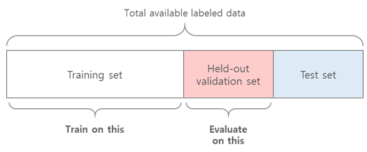
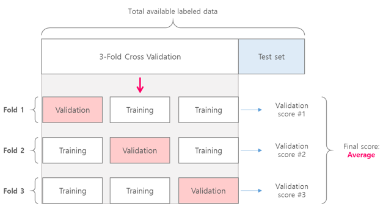
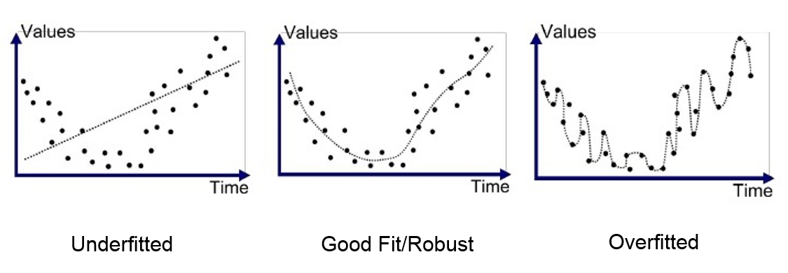

# Chap04 - 머신러닝의 기본 요소


## Goals

- 모델 평가, 데이터 전처리, 특성 공학, 오버피팅에 대해 알아본다.
- 머신러닝 문제 해결을 위한 작업 프로세스에 대해 알아본다.


## 4.1 머신러닝의 네 가지 분류

- 일반적으로 머신러닝 알고리즘은 아래의 그림과 같이 4개의 범주안에 속한다.


### 4.1.1 지도 학습 (Supervised Learning)

- 샘플 데이터가 주어지면 알고있는 타겟(레이블)에 입력 데이터를 매핑하는 방법을 학습한다.
- 문자 판독, 음성 인식, 이미지 분류, 언어 번역 등이 지도학습에 속한다.
- 지도학습은 대부분 분류(classification)와 회귀(regression)로 구성되지만 다음과 같은 특이한 변종도 많다.
  - **시퀀스 생성**(sequence generation) : 사진이 주어지면 이를 설명하는 캡션을 생성한다. 시퀀스 생성은 일련의 분류 문제로 재구성할 수 있다.
  - **구문 트리**(syntax tree) **예측** : 문장이 주어지면 분해된 구문 트리를 예측한다.
  - **물체 감지**(object detection) : 사진이 주어지면 사진 안의 특정 물체 주위에 경계 상자(bounding box)를 그린다. 이것은 분류 문제로 표현되거나, 경계 상자의 좌표를 벡터 회귀로 예측하는 회귀 + 분류가 결합된 문제로 표현될 수 있다.
  - **이미지 분할**(image segmentation) : 사진이 주어졌을 때 픽셀 단위로 특정 물체에 마스킹(masking)을 한다.


### 4.1.2 비지도 학습 (Unsupervised Learning)

- 타겟(레이블)을 사용하지 않고, 입력 데이터에 대해 유의미한 정보를 찾는 방법이다.
- 데이터 시각화, 데이터 압축, 데이터의 노이즈 제거, 데이터에 있는 상관관계를 더 잘 이해하기 위해 사용한다.
- 비지도 학습으로는 대표적으로 **차원 축소**(dimensionality reduction)와 **군집**(clustering)이 있다.


### 4.1.3 준지도 학습 (Semi-supervised Learning)

- 전체 데이터 중에서 일부에만 레이블되어 있는 경우에 대해 학습하는 방법을 말한다.
- 대부분의 준지도 학습은 지도 학습과 비지도 학습의 조합으로 이루어진다.


### 4.1.4 자기 지도 학습 (Self-supervised Learning)

- 자기 지도 학습은 지도 학습의 특별한 경우라고 할 수 있다.
- 자기 지도 학습은 지도 학습이지만 사람이 만든 레이블을 사용하지 않는다.
- 레이블이 필요하지만 보통 경험적인 알고리즘(heuristic algorithm)을 사용해서 입력 데이터로부터 생성한다.
  - **오토인코더**(AutoEncoder)에서의 레이블은 입력 데이터 자신이다.
  - 지난 프레임이 주어졌을 때 비디오의 다음 프레임을 예측
  - 이전 단어가 주어졌을 때 다음 단어를 예측
- 지도 학습, 자기 지도 학습, 비지도 학습의 구분은 때때로 모호할 수 있다.
  - 오토인코더의 경우 타겟이 있으므로, (자기)지도학습으로 볼 수 있지만, 입력 데이터의 차원 축소 용도로 사용될 때는 비지도 학습으로 볼 수 있다.


### 4.1.5 강화 학습 (Reinforcement Learning)

- 강화 학습에서 **에이전트**(agent)는 환경에 대한 정보를 받아 보상을 최대화하는 행동을 선택하도록 학습한다.


### 4.1.6 분류와 회귀에서 사용하는 용어

| 용어                                                         | 설명                                                         |
| ------------------------------------------------------------ | ------------------------------------------------------------ |
| **샘플(sample)** 또는 **입력(input)**                        | 모델에 주입될 하나의 데이터 포인트                           |
| **예측(predict)** 또는 **출력(output)**                      | 모델로부터 나오는 값                                         |
| **타겟(Target)**                                             | 정답, 모델이 완벽하게 예측해야 하는 값                       |
| **예측 오차(prediction error)** 또는 **손실 값(loss value)** : | 모델의 예측과 타깃 사이의 거리를 측정한 값                   |
| **클래스(class)**                                            | 분류 문제에서 선택할 수 있는 레이블의 집합                   |
| **레이블(label)**                                            | 분류 문제에서 클래스 할당의 구체적인 사례                    |
| **Ground-truth** 또는 **Annotation**                         | 데이터에셋에 대한 모든 타겟. 일반적으로 사람에 의해 수집된다. |
| **이진 분류**(Binary classification)                         | 각 입력 샘플이 2개의 범주로 구분되는 분류 작업               |
| **다중 분류**(Multiclass classification)                     | 각 입력 샘플이 2개 이상의 범주로 구분되는 분류 작업          |
| **다중 레이블 분류**(Multilabel classification)              | 각 입력 샘플이 여러 개의 레이블에 할당될 수 있는 분류 작업. 예를 들어 하나의 이미지에 고양이와 개가 있을 경우 '고양이'레이블과 '강아지'레이블이 모두 할당되어야 한다. |
| **스칼라 회귀**(Scalar regression)                           | 타겟이 연속적인 스칼라 값인 작업                             |
| **벡터 회귀**(Vector regression)                             | 타겟이 연속적인 값의 집합인 작업. 여러 값에 대한 회귀        |
| **미니 배치** 또는 **배치**(Mini-batch)                      | 모델에 의해 동시에 처리되는 소량의 샘플 묶음. 일반적으로 8 ~ 128이며, 샘플의 개수는 GPU의 메모리 할당이 용이하도록 2의 거듭제곱으로 한다. 훈련할 때 미니 배치마다 경사 하강법 업데이트 값을 계산한다. |


## 4.2 머신러닝 모델 평가

- 머신러닝의 목표는 처음 존 데이터에서 잘 작동하는 **일반화(generalized)**된 모델을 얻는 것이다.


### 4.2.1 훈련, 검증, 테스트 셋

- 모델 평가의 핵심은 데이터를 항상 훈련(training), 검증(valid), 테스트(test) 3개의 세트로 나누는 것이다.
  - 훈련 세트(training set)에서 모델을 훈련하고,
  - 검증 세트(validation set)에서 모델을 평가한다.
  - 테스트 세트를 이용해 모델을 테스트 한다.
- 전체 데이터 셋을 훈련과 테스트 2개만으로 나누지 않는 이유는, 모델을 개발할 때 항상 모델의 설정을 튜닝하기 때문이다.
  - 예를 들어, 층의 수나 층의 유닛 수를 조정할 수 있다. → 이러한 파라미터를 **하이퍼파라미터**(hyperparameter)라고 한다.
- 검증 세트에서 모델의 성능을 평가하여 이런 튜닝을 수행한다.
  - 이러한 튜닝 또한 어떠한 파라미터 공간에서 좋은 설정값을 찾는 **학습**이라 할 수 있다.
- 검증 세트를 이용해 설정을 튜닝하게 되면, **검증 세트에 오버피팅**될 수 있다.
  - 이러한 현상은 검증 세트의 모델 성능에 기반하여 모델의 하이퍼파라미터를 조정할 때마다 검증 데이터에 관한 정보가 모델로 새기 때문이다. → **정보 누설**(information leak)
- 따라서, 모델이 처음 본 데이터인 테스트 세트를 이용하여 모델을 평가한다.
  - 모델은 간접적으로라도 테스트 세트에 대한 어떠한 정보도 얻어서는 안된다.
- 데이터를 훈련/검증/테스트 세트로 나누는 대표적인 방법으로는 다음과 같이 세가지 방법이 있다.
  - 홀드아웃 검증 (hold-out validation)
  - K-폴드 교차 검증 (K-fold cross-validation)
  - 셔플링(shuffling)을 사용한 iterated K-fold cross-validation


#### Simple Hold-Out Validation

- 전체 데이터 셋에서 일정량을 테스트 셋으로 떼어 놓는다.
- 남은 데이터에서 훈련하고 검증 세트로 평가한다.





- `NumPy`를 이용한 홀드아웃 검증 구현 코드는 다음과 같다.

```python
import numpy as np

num_validation_samples = 10000

np.random.shuffle(data)  # 데이터를 섞는것이 일반적으로 좋다.

validation_data = data[:num_validation_samples]  # 검증 셋을 만든다.
training_data = data[num_validation_samples:]  # 훈련 셋을 만든다.
```


- `Scikit-learn`을 이용한 홀드아웃 검증 구현은 다음과 같다.

```python
from sklearn.model_selection import train_test_split

train_dat, test_data, train_labels, test_labels = train_test_split(data, labels, test_size=0.33, random_state=42)
```


- 홀드아웃의 단점은 데이터가 적을 때, 검증 세트와 테스트 세트의 샘플이 너무 적어 주어진 전체 데이터를 통계적으로 대표하지 못할 수 있다.


#### K-Fold Cross Validation

- 데이터를 동일한 크기를 가진 `K`개의 분할로 나눈다.
- 각 분할 `i`에 대해 남은 `K-1`개의 분할로 모델을 훈련하고 분할 `i`에 대해 모델을 평가한다.
- 최종 점수는 `K`개의 점수의 평균을 구한다.
- 모델의 성능이 데이터 분할에 때라 편차가 클 때 유용하다.
- 모델의 튜닝에 별개의 검증 세트를 사용하게 된다.




- K-fold cross validation의 구현 코드는 아래와 같다.

```python
k = 4
num_validation_samples = len(data) // k

np.random.shuffle(data)

validation_scores = []
for fold in range(k):
    # 검증 데이터 부분을 선택한다.
    validation_data = data[num_validation_samples * fold : num_validation_samples * (fold + 1)]
    # 남은 데이터를 훈련 데이터로 사용한다. 
    # 리스트에서 + 연산자는 두 리스트를 연결한다.
    training_data = data[:num_validation_samples * fold] + 
    	data[num+validation_samples * (fold + 1):]
    
    model = get_model()  # 훈련되지 않은 새로운 모델을 만든다.
    model.train(training_data)
    validation_score = model.evaluate(validation_data)
    validation_scores.append(validation_score)
    
validation_score = np.average(validation_scores)  # 검증 점수: K개의 폴드에 대한 평균

model = get_model()  
model.train(data)  # 테스트 데이터를 제외한 전체 데이터로 최종 모델을 훈련
test_score = model.evaluate(test_data)
```


- k-fold cross validation은 `scikit-learn`의 `cross_validate()`함수를 이용해 쉽게 구현할 수 있는데, 케라스 모델을 사이킷런과 호환되도록 `KerasClassifier`나 `KerasRegressor` 클래스로 모델을 감싸줘야 한다.

```python
from keras.wrappers.scikit_learn import KerasClassifier
from sklearn.model_selection import cross_validate

model = KerasClassifier(build_fn=get_model, epochs=150, batch_size=128, verbose=0)
kfold = cross_validate(model, data, labels, cv=4)
```


#### Iterated K-fold Validation with Suffling

- K-fold 검증을 여러 번 적용하되, `K`개의 분할로 나누기 전에 매번 데이터를 랜덤하게 섞는다.
- `P x K`개(P는 반복 횟수)의 모델을 훈련하고 평가하기 때문에 비용이 매우 많이 든다.
- 최종 점수는 모든 K-fold 검증(`P x K`)의 평균이다.

- 데이터가 적고 가능한 정확하게 모델을 평가하고자 할 때 사용한다.
- Kaggle에서는 이 방법이 매우 도움이 된다고 한다.
- 이 방법에 대한 예제는 해당 링크에서 확인할 수 있다. → [[링크](https://tensorflow.blog/2017/12/27/%EB%B0%98%EB%B3%B5-%EA%B5%90%EC%B0%A8-%EA%B2%80%EC%A6%9D/)]


### 4.2.2 유의해야 할 것

1. **대표성 있는 데이터** : 훈련 세트와 테스트 세트로 나누기 전에 데이터를 랜덤하게 섞어 주는 것이 좋다.
2. **시간의 방향** : 과거로 부터 미래를 예측해야 하는 시계열 데이터의 경우에는 데이터를 분할하기 전에 랜덤하게 섞어서는 절대로 안된다. 따라서, 테스트 데이터는 훈련 데이터보다 미래의 것이어야 한다.
3. **데이터 중복** : 훈련 세트와 검증 세트가 중복되지 않아야 한다.


## 4.3 데이터 전처리, 특성 공학, 특성 학습


### 4.3.1 신경망을 위한 데이터 전처리

- 데이터 전처리(data preprocessing)의 목적은 주어진 원본 데이터를 신경망에 적용하기 쉽도록 만드는 것이다.
- 벡터화(vectorization), 정규화(normalization), 누락된 값 다루기, 특성 추출(feature extraction) 등이 있다.


#### 벡터화 (Vectorization)

- 신경망에서 모든 입력과 타겟(레이블)은 부동 소수(`float`)데이터(특정 경우에는 정수)로 이루어진 **텐서**(tensor)여야 한다.
- 사운드, 이미지, 텍스트 등의 입력은 먼저 텐서로 변환해야 하는데 이러한 단계를 **데이터 벡터화(data vectorization)**라고 한다.


#### 정규화 (Normalization)

- 신경망에서 입력 데이터는 네트워크에 주입하기 전에 각 특성(feature)별로 독립적으로 정규화 해줘야 한다.
- 일반적으로 네트워크의 **가중치 초기값보다 큰 입력 데이터**이거나, 각 **특성의 범위가 균일하지 않는 데이터**(예를 들어 한 특성의 범위는 0~1, 다른 특성은 100~200인 경우)를 신경망에 주입하는 것은 좋지 않다.
  - 이러한 경우에 업데이트할 그래디언트가 커져 네트워크가 제대로 수렴하지 못하는 문제가 발생한다.
- 네트워크가 쉽게 학습하기 위해서는 입력 데이터가 다음과 같은 특징을 따라야 한다.
  - **작은 값**이어야 한다. 일반적으로 `0 ~ 1` 사이로 정규화 한다. 
    - 자주 사용 되는 방법은 각 특성이 평균이 0이고, 표준편차가 1이되도록 정규화 해준다.
  - **균일**해야 한다. 모든 특성이 비슷한 범위를 가져야 한다.


#### 누락된 값(Missing Values) 다루기

- 이따금 데이터에는 누락된 값(결측값, missing values)이 있을 수 있다.
- 일반적으로 신경망에서 `0`이 특별한 의미를 가지는 값이 아니라면, 누락된 값을 `0`으로 입력해도 된다.
  - 네트워크가 `0`이 누락된 데이터를 의미한다는 것을 학습하면, 이 값을 무시하게 된다.
- 훈련(training) 세트에 누락된 값을 해당 특성의 평균(mean) 또는 중간값(median)으로 대체할 경우에는 그 값을 저장해 놓아야 한다.
  - 테스트 세트에서 해당 특성에 누락된 값이 있다면 훈련 세트에서 구한 값으로 채워줘야 한다.
  - 마찬 가지로 검증 데이터 세트에도 동일하게 훈련 세트에서 구한 값으로 채워준다.
- 훈련 세트에는 결측값이 없는데 테스트 세트에서는 결측값이 있을 경우에는 네트워크는 결측값을 무시하는 법을 알지 못한다.
  - 이럴 경우에는 누락된 값이 있는 훈련 샘플을 임의로 만들어줘야 한다.


### 4.3.2 특성 공학 (Feature Engineering)

- 특성 공학은 데이터와 머신러닝 알고리즘에 관한 지식을 사용하는 것이라 할 수 있다.
- 모델에 데이터를 주입하기 전에 **하드코딩**된 변환을 적용하여 알고리즘이 더 잘 수행되도록 만들어 준다.
  - 모델이 잘 학습할 수 있도록 데이터를 재 표현하는 방법을 의미한다.
- 특성 공학의 핵심은 특성을 더 간단한 방식으로 표현하여 문제를 쉽게 만드는 것이다.
- 딥러닝에서는 신경망이 자동으로 원본 데이터에서 유용한 특성을 추출할 수 있기 때문에 특성 공학의 중요도가 높진 않다.
  - 하지만, 특성 공학을 사용하면 다음과 같은 장점이 있다.
    - 좋은 특성은 적은 자원을 사용해 문제를 쉽게 해결할 수 있다.
    - 좋은 특성은 더 적은 데이터로 문제를 풀 수 있다.


## 4.4. 과대적합과 과소적합




- 머신러닝의 근본적인 이슈는 최적화와 일반화 사이의 줄다리기라고 할 수 있다.
  - 이 중에서 가장 중요한 것은 최적화가 아니라 **일반화**이다.
- **최적화**(optimization)는 훈련 데이터에서 최고의 성능을 얻기위해 모델을 조정하는 과정이다 → 학습(learning)
- **일반화**(generalization)는 학습된 모델이 새로운 데이터에 대해 얼마나 잘 수행하는지를 의미한다.
- **과소적합**(underfitting)은 훈련 데이터의 손실이 낮아질수록 검증 데이터의 손실도 낮아지는 단계를 말한다.
- **과대적합**(overfitting)은 훈련 데이터의 손실은 낮아지지만 검증 세트의 손실이 증가하게 되는 상황을 말한다.
  - 훈련 데이터에 특화된 패턴을 학습하기 시작했다는 의미이다.
  - 과대적합을 없애기 위해서 가장 좋은 방법은 **더 많은 훈련 데이터를 모으는 것이다.**
  - 데이터를 더 모으는 것이 불가능할 때 모델이 훈련 데이터에서 학습할 수 있는 패턴에 제약을 가해 과대적합을 피할 수 있는데, 이를 **규제(regularization)**라고 한다.


### 4.4.1 네트워크 크기 축소

- 과대적합을 막는 가장 단순한 방법은 모델의 크기, 모델에 있는 학습 파라미터의 수를 줄이는 것이다.
  - 파라미터의 수는 층의 수와 각 층의 유닛 수에 의해 결정된다.
  - 딥러닝에서 모델에 있는 학습 파라미터의 수를 모델의 용량(capacity)라고도 한다.
- 적절한 모델 크기를 찾는 일반적인 작업 흐름은 우선 적은 수의 층과 파라미터로 시작한다. 그런 다음 검증 손실이 감소되기 시작할 때까지 층이나 유닛의 수를 늘려 나간다.
- 실습은 링크 참고 → [[링크]](https://github.com/ExcelsiorCJH/Deep-Learning-with-Python/blob/master/Chap04-Fundamentals_of_machine_learning/Chap04-Fundamentals_of_machine_learning.ipynb) 이동


### 4.4.2 가중치 규제 추가

- **오컴의 면도날**(Occam's razor) : 어떤 것에 대한 두가지의 설명이 있다면 더 적은 가정이 필요한 간단한 설명이 옳을 것이라는 이론
    - 이러한 이론은 딥러닝 모델에도 적용된다.
- 복잡한 모델이 간단한 모델보다 과대적합될 가능성이 높다.
- 간단한 모델은 적은 수의 파라미터를 가진 모델을 말한다.
- 과대적합을 완화하기 위한 방법은 네트워크의 복잡도에 제한을 두어 가중치가 작은 값을 가지도록 제약을 가하는 것이다.
    - 가중치를 작게 만든다는 의미는 특정값(outlier 등)의 영향을 적게 받도록 해줌으로써, 결과적으로 일반화에 적합한 특성을 갖게 만드는 것이라 할 수 있다.([[링크]](https://m.blog.naver.com/laonple/220527647084) 참고)
    - 이러한 제약을 통해 가중치 값의 분포가 더 균일하게 된다.
- 이를 **가중치 규제**(weight regularization)라고 하며, 네트워크의 손실함수에 큰 가중치에 연관된 비용을 추가하는 데, 두 가지 형태의 비용이 있다.
    - **L1 규제** : 가중치의 절대값에 비례하는 비용이 추가된다(가중치의 L1 노름). → $\lambda  \mid w \mid$
    - **L2 규제** : 가중치의 제곱에 비례하는 비용이 추가된다(가중치의 L2 노름). L2 규제는 신경망에서 가중치 감쇠(weight decay)라고도 부른다. → $\frac{1}{2} \lambda w^2$
    
- 실습은 링크 참고 → [[링크]](https://github.com/ExcelsiorCJH/Deep-Learning-with-Python/blob/master/Chap04-Fundamentals_of_machine_learning/Chap04-Fundamentals_of_machine_learning.ipynb) 이동


### 4.4.3 드롭아웃 (Dropout)

- **드롭아웃(dropout)** 은 신경망에서 사용되는 규제 기법 중에서 가장 효과적이고 널리 사용되는 방법 중 하나다.
- 드롭아웃의 핵심 아이디어는 층의 출력값에 노이즈(랜덤하게 끄는것)를 추가하여 중요하지 않은 우연한 패턴을 네트워크가 학습하지 못하게 하는 것이다.
- 네트워크 층에 드롭아웃을 적용하면 **훈련하는 동안** 랜덤하게 층의 일부 출력 특성(유닛)을 제외시킨다(0으로 만든다).


- 드롭아웃 비율(`p`)은 일반적으로 `0.2 ~ 0.5`로 설정한다.
- 테스트 단계에서는 어떠한 유닛도 드롭아웃 되지 않는다.
    - 그 대신 층의 출력을 드롭아웃 비율(`p`)에 비례하여 줄여준다. → `layer_output *= p`
    - 그 이유는 훈련할 때보다 더 많은 유닛이 활성화되기 때문이다. → keras에서는 자동으로 계산해줌
- 케라스에서는 층의 출력 바로 뒤에 `Dropout`층을 추가하여 네트워크에 드롭아웃을 적용할 수 있다.

```python
from keras import layers

model.add(layers.Dropout(0.5))
```

- 실습은 링크 참고 → [[링크]](https://github.com/ExcelsiorCJH/Deep-Learning-with-Python/blob/master/Chap04-Fundamentals_of_machine_learning/Chap04-Fundamentals_of_machine_learning.ipynb) 이동


### 4.4.4 정리


신경망에서 과대적합을 방지하기 위해 가장 널리 사용하는 방법은 다음과 같다.

- 훈련 데이터를 더 모은다.
- 네트워크 용량을 감소 시킨다(파라미터 수를 줄인다).
- 가중치 규제($l1, l2$)를 추가한다.
- 드롭아웃을 추가한다.

